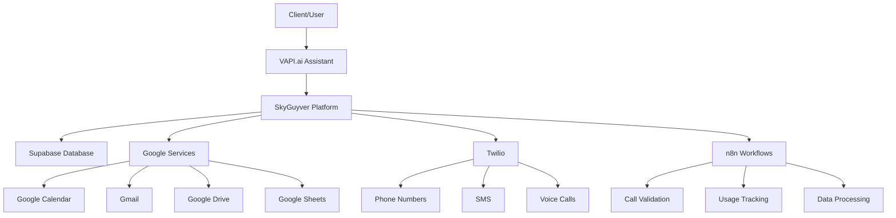

# Integrations

## Overview

This section documents all third-party integrations and external service configurations for the SkyGuyver voice AI platform. These integrations enable advanced functionality and seamless connectivity with popular business tools and services.

## Available Integrations

### Google Services

#### [Google OAuth Setup Guide](./google/oauth-setup)

- **Purpose**: Configure Google OAuth for VAPI.ai assistants
- **Services**: Google Calendar, Gmail, Drive, Sheets, Contacts
- **Setup Time**: 20-30 minutes (standard) | 4-8 hours (multi-client)
- **Complexity**: ⭐⭐⭐ (Medium to Advanced)

**Key Features:**

- ✅ Single Google account integration for organization
- ✅ Multi-client setup with custom backend
- ✅ Comprehensive security best practices
- ✅ Production deployment guidelines
- ✅ Troubleshooting and error handling

**Use Cases:**

- Calendar scheduling through voice assistants
- Email management and sending
- Document access and creation
- Contact management
- Multi-tenant client solutions

## Integration Categories

### **Authentication Services**

- Google OAuth 2.0
- Microsoft Azure AD (Coming Soon)
- Custom JWT Authentication

### **Communication Services**

- Twilio (Phone & SMS)
- Email Services (Gmail, Outlook)
- Slack Integration (Planned)

### **Business Applications**

- Google Workspace (Calendar, Drive, Sheets)
- Microsoft 365 (Planned)
- CRM Systems (Planned)

### **Voice AI Platform**

- VAPI.ai (Primary voice AI service)
- Custom voice backends
- Speech-to-text services

### **Database & Storage**

- Supabase PostgreSQL
- Google Drive storage
- File upload services

## Architecture Overview



## Integration Best Practices

### Security Guidelines

- **OAuth 2.0**: Use standard OAuth flows for authentication
- **Token Management**: Secure storage and automatic refresh
- **Scope Minimization**: Request only necessary permissions
- **Data Encryption**: Encrypt sensitive data at rest and in transit

### Development Workflow

1. **Development**: Test integrations in sandbox environments
2. **Staging**: Validate with production-like data
3. **Production**: Deploy with monitoring and alerting
4. **Maintenance**: Regular updates and security patches

### Multi-Client Considerations

- **Data Isolation**: Ensure client data separation
- **Scalability**: Design for growth and concurrent users
- **Compliance**: Meet data protection regulations
- **Monitoring**: Track usage and performance metrics

## Quick Start Guides

### New Integration Checklist

- [ ] Review integration requirements and limitations
- [ ] Set up development environment
- [ ] Configure authentication (OAuth, API keys, etc.)
- [ ] Implement basic functionality
- [ ] Add error handling and logging
- [ ] Test in staging environment
- [ ] Deploy to production
- [ ] Set up monitoring and alerts

### Common Integration Patterns

#### **1. OAuth-Based Integrations**

```javascript
// Standard OAuth flow implementation
const oauth = new OAuth2Client(clientId, clientSecret, redirectUri);
const authUrl = oauth.generateAuthUrl({ scope: requiredScopes });
// Redirect user to authUrl, handle callback, store tokens
```

#### **2. API Key Integrations**

```javascript
// API key-based service calls
const api = new ServiceAPI({ apiKey: process.env.SERVICE_API_KEY });
const result = await api.performAction(parameters);
```

#### **3. Webhook Integrations**

```javascript
// Webhook handler for incoming data
app.post('/webhook/service-name', (req, res) => {
  const payload = req.body;
  await processWebhookData(payload);
  res.status(200).send('OK');
});
```

## Service Status

| Service       | Status    | Last Updated | Health Check                            |
| ------------- | --------- | ------------ | --------------------------------------- |
| Google OAuth  | ✅ Active | 2025-11-06   | [Monitor](https://status.google.com/)   |
| VAPI.ai       | ✅ Active | 2025-11-06   | [Monitor](https://status.vapi.ai/)      |
| Twilio        | ✅ Active | 2025-11-06   | [Monitor](https://status.twilio.com/)   |
| Supabase      | ✅ Active | 2025-11-06   | [Monitor](https://status.supabase.com/) |
| n8n Workflows | ✅ Active | 2025-11-06   | Internal monitoring                     |

## Troubleshooting Resources

### Common Issues

- **Authentication Failures**: Check credentials and scopes
- **Rate Limits**: Implement proper retry logic and backoff
- **Webhook Failures**: Verify endpoint accessibility and response codes
- **Token Expiration**: Implement automatic token refresh

### Support Channels

- **Documentation**: This knowledge base
- **Service Status**: Check individual service status pages
- **Community**: VAPI Discord, Google Developer forums
- **Support**: Direct contact with service providers

## Upcoming Integrations

### Planned Q1 2026

- **Microsoft 365**: Calendar, Outlook, Teams integration
- **Slack**: Team communication and notifications
- **Zoom**: Meeting scheduling and management

### Under Consideration

- **HubSpot CRM**: Customer relationship management
- **Stripe**: Payment processing and billing
- **Zapier**: No-code automation workflows
- **AWS Services**: Additional cloud services integration

---

**Related Documentation:**

- [Workflows & Automation](../workflows/)
- [Supabase Database](../supabase/)
- [Operations & Business Management](../operations/)
- [Architecture Overview](../architecture/)

**External Resources:**

- [VAPI.ai Documentation](https://docs.vapi.ai/)
- [Google Cloud Console](https://console.cloud.google.com/)
- [Twilio Console](https://console.twilio.com/)
- [Supabase Dashboard](https://app.supabase.com/)
