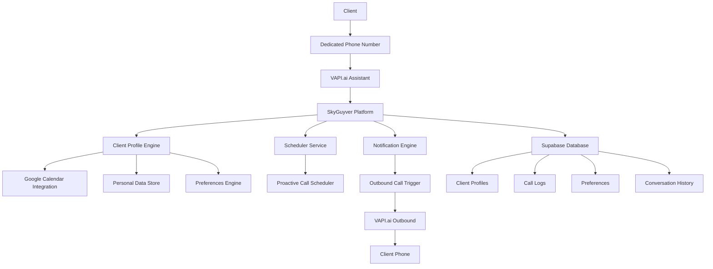

# Personal AI Butler Service

## 🎯 Executive Summary

**"Your Personal AI Assistant - Available 24/7, Inbound & Outbound"**

A premium subscription service that provides each client with their own dedicated AI assistant accessible via voice calls. The assistant can be called anytime for information and proactively calls the client with reminders, updates, and important notifications.

**Tagline**: _"Call Jarvis. Jarvis Calls You."_

---

## 4. Technology Implementation

### **Core Technology Stack:**

- **VAPI.ai**: Voice AI and natural conversation processing
- **Twilio**: New Zealand phone number and SMS capabilities
- **Supabase**: Real-time database for schedules and preferences
- **n8n**: Workflow automation and calendar integrations
- **Google Calendar API**: Calendar access and management
- **OpenAI GPT-4**: Advanced reasoning and context understanding

### **Smart Scheduling Technical Architecture:**

#### **Calendar Intelligence Engine:**

```javascript
// Appointment Priority Classifier
const classifyAppointment = (event) => {
  const highPriorityKeywords = [
    "client",
    "board",
    "presentation",
    "family",
    "medical",
  ];
  const revenueThreshold = 10000; // NZD

  if (event.attendees?.some((a) => a.value > revenueThreshold)) return "high";
  if (highPriorityKeywords.some((k) => event.title.toLowerCase().includes(k)))
    return "high";
  if (event.attendees?.length <= 3) return "medium";
  return "low";
};

// Smart Bundling Algorithm
const optimizeDailySchedule = (appointments) => {
  const prioritized = appointments.map(classifyAppointment);
  const highPriority = prioritized.filter((p) => p.priority === "high");
  const others = prioritized.filter((p) => p.priority !== "high");

  return {
    individualCalls: highPriority,
    briefingContent: others,
    callsRequired: highPriority.length + 1, // +1 for consolidated brief
  };
};
```

#### **Real-Time Learning System:**

- **Pattern Recognition**: Learns which meetings client considers important
- **Behavioral Adaptation**: Adjusts timing based on client preferences
- **Feedback Integration**: Improves priority classification over time
- **Usage Optimization**: Balances thoroughness with call limit efficiency

### **Integration Capabilities:**

#### **Supported Calendar Platforms:**

- Google Calendar (primary)
- Microsoft Outlook
- Apple Calendar (via CalDAV)
- Custom API integrations

#### **Communication Channels:**

- **Voice Calls**: Primary interface via VAPI.ai
- **SMS Alerts**: Quick updates via Twilio
- **Email Summaries**: Daily/weekly reports
- **WhatsApp**: For urgent notifications (future feature)

#### **CRM Integration Potential:**

- Salesforce
- HubSpot
- Pipedrive
- Custom business systems via API

---

## 🎪 Service Features

### **Core AI Assistant Capabilities**

#### **Information Services**

- **Schedule Management**: "What's my schedule today?"
- **Weather & Traffic**: "What's the weather for my commute?"
- **Reminders**: "Remind me to call John at 2pm"
- **Calendar Queries**: "When is my next available slot?"
- **Task Management**: "Add 'buy groceries' to my to-do list"
- **Contact Information**: "What's Sarah's phone number?"

#### **Proactive Services**

- **Meeting Reminders**: Calls 15 minutes before meetings
- **Daily Briefings**: Morning schedule overview
- **Traffic Alerts**: Departure time notifications with traffic updates
- **Deadline Reminders**: Project due date notifications
- **Follow-ups**: "Did you complete that task we discussed?"
- **Emergency Alerts**: Important notifications that can't wait

### **Personalization Features**

#### **Custom Assistant Personality**

- Client chooses assistant name (Jarvis, Friday, Alfred, etc.)
- Customizable voice and personality traits
- Learning client preferences and communication style
- Personalized greetings and responses

#### **Smart Scheduling**

- Learns client's preferred reminder timing
- Adapts to time zones and travel schedules
- Understands work vs. personal time boundaries
- Respects "Do Not Disturb" hours

#### **Contextual Intelligence**

- Remembers previous conversations
- Understands client's priorities and preferences
- Provides relevant suggestions based on schedule/location
- Maintains conversation history and context

---

## 🏗️ Technical Architecture

### **System Components**



### **Key Technical Features**

#### **Inbound Call Handling**

- Dedicated phone number per client
- Instant recognition and personalized greeting
- Context-aware responses based on client data
- Real-time access to calendars and information

#### **Outbound Call Engine**

- Smart scheduling based on calendar events
- Timezone-aware calling
- Configurable reminder timing
- Emergency override capabilities

#### **Data Integration**

- Google Calendar/Outlook synchronization
- Contact management system
- Task and reminder storage
- Personal preferences and settings

#### **Intelligence Layer**

- Natural language processing for complex requests
- Learning algorithm for personalization
- Conversation memory and context retention
- Predictive scheduling and recommendations

---

## 💰 Business Model

### **Subscription Tiers (New Zealand Launch)**

> **Market Focus**: Starting with New Zealand market using existing Twilio NZ numbers. International expansion planned for Year 2.

#### **Personal Assistant - Basic ($79 NZD/month)**

**Core Service:**

- Dedicated NZ phone number (+64) and personalized AI assistant
- Custom assistant name (Jarvis, Friday, Alfred, or client's choice)

**Inbound Call Allowance:**

- **Unlimited inbound calls** - Client can call their assistant anytime
- **Cost Structure**: Each call costs ~$0.50 NZD (VAPI + Twilio)
- **Fair Use Policy**: Up to 100 minutes/month included (average 3-4 calls/day)
- **Overage**: $0.75 NZD per additional minute

**Outbound Call Allowance:**

- **5 outbound calls per month** (not minutes - actual call count)
- **Typical Use**: Meeting reminders, daily briefings, deadline alerts
- **Call Duration**: Up to 3 minutes per outbound call included
- **Overage**: $2.50 NZD per additional outbound call

**Included Features:**

- Google Calendar integration
- Basic appointment reminders (15-30 min before meetings)
- Simple schedule queries ("What's my day looking like?")
- Email support (48-hour response)

**Cost Breakdown for Provider:**

- VAPI costs: ~$25 NZD/month (estimated 100 min inbound + 15 min outbound)
- Twilio costs: ~$8 NZD/month (phone number + usage)
- **Total costs**: ~$33 NZD/month
- **Profit margin**: $46 NZD/month (58% margin)

---

#### **Personal Assistant - Professional ($149 NZD/month)**

**Everything in Basic, plus:**

**Enhanced Outbound Allowance:**

- **25 outbound calls per month** (5x more than Basic)
- **Use Cases**: Daily briefings, complex reminders, follow-ups, traffic alerts
- **Smart Scheduling**: AI learns best times to call based on your schedule
- **Overage**: $2.00 NZD per additional call (reduced rate)

**Advanced Features:**

- Multiple calendar integration (Google + Outlook + Apple Calendar)
- Task management and to-do list integration
- **Daily briefings**: Morning schedule overview calls (counts toward allowance)
- **Weekly planning calls**: Sunday evening schedule review
- Smart reminders with context ("Meeting with John about the Henderson project")
- Priority support (24-hour response)

**Inbound Enhancement:**

- **Extended fair use**: 200 minutes/month included
- **Advanced queries**: Complex schedule analysis, travel planning
- **Conversation memory**: Remembers previous discussions and preferences

**Cost Breakdown for Provider:**

- VAPI costs: ~$45 NZD/month (200 min inbound + 75 min outbound)
- Twilio costs: ~$12 NZD/month
- **Total costs**: ~$57 NZD/month
- **Profit margin**: $92 NZD/month (62% margin)

---

#### **Personal Assistant - Executive ($299 NZD/month)**

**Everything in Professional, plus:**

**Unlimited Outbound Calls:**

- **No monthly limit** on outbound calls
- **Premium use cases**: Travel updates, emergency notifications, client reminders
- **Proactive intelligence**: AI suggests useful calls based on calendar/context
- **Emergency override**: Immediate calls for urgent matters

**Executive Features:**

- **Advanced AI personality**: Custom voice training, specific communication style
- **Multi-timezone support**: Perfect for international business
- **Travel assistant**: Flight updates, hotel confirmations, itinerary management
- **Emergency contact system**: AI can reach you through multiple numbers
- **VIP support**: Dedicated account manager, 4-hour response guarantee

**Enhanced Inbound:**

- **Unlimited inbound minutes** (no fair use limit)
- **Complex analysis**: "Find me 2 hours free time this week for project planning"
- **Research assistance**: Basic information gathering and summarization

**Cost Breakdown for Provider:**

- VAPI costs: ~$85 NZD/month (unlimited usage, premium features)
- Twilio costs: ~$20 NZD/month (multiple numbers, international)
- **Support costs**: ~$35 NZD/month (dedicated account management)
- **Total costs**: ~$140 NZD/month
- **Profit margin**: $159 NZD/month (53% margin)

---

#### **Enterprise Butler ($699 NZD/month)**

**Multi-User Business Solution:**

**Team Features:**

- **Up to 5 assistant profiles** (for different team members)
- **Shared company directory** and contact management
- **Team scheduling coordination**: "Find a time when Sarah, Mike, and I are all free"
- **Delegation management**: AI can coordinate between assistants

**Business Integrations:**

- **CRM integration**: Salesforce, HubSpot connection
- **Project management**: Asana, Monday.com integration
- **Advanced reporting**: Usage analytics, productivity insights
- **White-label options**: Custom branding for larger organizations

**Unlimited Everything:**

- **No limits** on inbound or outbound calls across all profiles
- **Priority infrastructure**: Dedicated servers for reliability
- **24/7 support**: Direct phone line to technical team

**Cost Breakdown for Provider:**

- VAPI costs: ~$200 NZD/month (multiple users, premium features)
- Infrastructure: ~$80 NZD/month (dedicated resources)
- Support: ~$120 NZD/month (24/7 coverage)
- **Total costs**: ~$400 NZD/month
- **Profit margin**: $299 NZD/month (43% margin)

---

### **Usage Limits Explained in Detail**

#### **What "Unlimited Inbound" Really Means:**

**Technical Reality:**

- Each inbound call costs us ~$0.50 NZD (VAPI + Twilio combined)
- "Unlimited" has fair use policies to prevent abuse
- **Basic tier**: 100 minutes/month fair use (covers 95% of normal users)
- **Professional tier**: 200 minutes/month fair use
- **Executive tier**: True unlimited (absorbed as premium service cost)

**Fair Use Examples:**

- **Normal usage**: 3-5 calls/day, 2-4 minutes each = ~60-100 minutes/month
- **Heavy usage**: 8-10 calls/day, 3-5 minutes each = ~180-250 minutes/month
- **Abuse prevention**: If usage exceeds 500 minutes/month, we review account

#### **Outbound Call Count vs. Duration:**

**Why Count Calls, Not Minutes:**

- **Predictable costs**: Each outbound call setup costs ~$0.30 NZD (Twilio connection)
- **VAPI costs**: ~$0.50-1.00 NZD per minute for AI generation
- **Average call**: Most reminder calls are 1-3 minutes (brief and purposeful)

**Outbound Call Examples:**

1. **Meeting reminder**: "Hi Sarah, just calling to remind you about your 3pm meeting with the Henderson team. You'll need the Q3 reports. Have a great day!" (1-2 minutes)

2. **Daily briefing**: "Good morning! Here's your schedule for today: 9am meeting with John about the project proposal, lunch with the marketing team at 12:30, and your 3pm presentation to the board. Weather is sunny, 18 degrees. Traffic to the city is light." (2-3 minutes)

3. **Travel update**: "Hi, your flight to Auckland has been delayed by 30 minutes. New departure time is 2:45pm. I've notified your Auckland meeting that you'll be 20 minutes late." (1-2 minutes)

**Monthly Outbound Breakdown:**

- **Basic (5 calls)**: Perfect for essential reminders only
- **Professional (25 calls)**: Daily briefings (22) + important reminders (3)
- **Executive (unlimited)**: All briefings + travel + emergency + proactive suggestions

---

### **🧠 Smart Scheduling & Call Optimization**

> **Critical Challenge Solved**: A busy executive with 10 appointments/day would exhaust 25 monthly calls in just 2.5 days! Our intelligent system prevents this.

#### **The Problem:**

Traditional per-call limits fail for busy professionals:

- 10 appointments = 10 calls = monthly limit exceeded in 3 days ❌
- Clients feel restricted instead of supported
- Unpredictable overage charges
- Forces clients to ration their assistant usage

#### **Our Solution: Intelligent Call Consolidation**

**Smart Bundling Logic:**

```
Instead of: 10 separate calls for 10 appointments
Smart System: 1 morning brief covering multiple appointments

Example Morning Brief:
"Good morning! You have 4 meetings today:
• 9am - Team standup in Conference Room A
• 11am - Client presentation via Zoom (need Q3 slides)
• 2pm - Lunch with Sarah at Cafe Central
• 4pm - Budget review with Finance team
Traffic is light, weather is 18°C and sunny.
Would you like details on any specific meeting?"
```

#### **Intelligent Scheduling Rules:**

**1. Consolidated Briefing System:**

- **Morning Brief (7:30am)**: Covers entire day's routine appointments
- **Midday Update (12:30pm)**: Changes, traffic, afternoon prep
- **Evening Brief (6:30pm)**: Tomorrow's schedule and preparation
- **One brief = unlimited routine appointments**

**2. Priority-Based Call Distribution:**

**High Priority (Individual Calls):**

- Client meetings with revenue >$10K NZD
- Board meetings, investor presentations
- Family events (anniversaries, kids' activities)
- Travel departures (flights, important trips)
- Medical appointments
- Legal meetings

**Medium Priority (Bundled in Briefings):**

- Internal team meetings
- Regular 1-on-1s with staff
- Routine client check-ins
- Vendor meetings

**Low Priority (Brief Mention Only):**

- Coffee chats and informal meetings
- Optional webinars or training
- Lunch breaks (unless business lunch)

#### **Updated Subscription Features:**

| Feature                            | Basic ($79)  | Professional ($149) | Executive ($299) | Enterprise ($699)       |
| ---------------------------------- | ------------ | ------------------- | ---------------- | ----------------------- |
| **Smart Morning Briefings**        | ✅ Daily     | ✅ Daily + Midday   | ✅ 3x daily      | ✅ Custom schedule      |
| **High Priority Individual Calls** | 5/month      | 15/month            | 50/month         | Unlimited               |
| **Appointments per Brief**         | Up to 5      | Up to 8             | Up to 12         | Unlimited               |
| **Priority Level Customization**   | Basic rules  | Custom categories   | AI learning      | Full customization      |
| **Emergency Override Calls**       | 2/month      | 5/month             | 10/month         | Unlimited               |
| **Calendar Learning**              | Manual setup | Basic patterns      | Advanced AI      | Predictive intelligence |

#### **Real-World Usage Example:**

**Scenario: Executive with 8 appointments**

**Traditional Approach (Would Fail):**

- 8 individual calls = 32% of monthly limit in one day ❌

**Smart SkyGuyver Approach:**

```
7:30am Morning Brief (1 call):
"Good morning Sarah! Busy day with 6 routine meetings and 2 high-priority ones..."

10:45am High-Priority Alert (1 call):
"Henderson client presentation in 15 minutes. Q3 slides ready..."

2:15pm High-Priority Alert (1 call):
"Board meeting in 15 minutes. 23% growth to discuss..."

6:30pm Evening Brief (1 call):
"Tomorrow: 4 meetings, Morrison call is priority..."

Total: 4 calls for 8 appointments ✅
```

#### **Client Control Dashboard:**

**Priority Settings Interface:**

- **Drag & Drop Calendar**: Move appointments between priority levels
- **Keyword Triggers**: "Client," "Board," "Family" = auto high-priority
- **Revenue Thresholds**: Meetings >$10K NZD = individual calls
- **Learning Feedback**: "This was more important than I thought" button

#### **Cost Management & Transparency:**

**Overage Protection System:**

- **80% Warning**: Smart bundling optimizes remaining usage
- **90% Auto-Bundling**: Switches to briefing-only mode automatically
- **Overage Approval**: Emergency calls require approval
- **Usage Dashboard**: Real-time tracking and efficiency metrics

**Business Benefits:**

- **Higher Satisfaction**: Clients feel supported, not limited
- **Lower VAPI Costs**: Fewer total calls through smart bundling
- **Competitive Advantage**: No other service offers intelligent optimization
- **Better Retention**: Clients don't feel restricted by artificial limits

---

### **New Zealand Market Focus**

#### **Why Start in NZ:**

- ✅ **Existing Twilio infrastructure**: You already have NZ numbers and experience
- ✅ **English-speaking market**: No language barriers for MVP
- ✅ **High disposable income**: Wellington/Auckland professionals willing to pay premium
- ✅ **Early adopter culture**: Tech-friendly business environment
- ✅ **Regulatory familiarity**: You understand NZ telecom regulations
- ✅ **Time zone advantage**: Can provide "overnight" development before global expansion

#### **NZ Market Size:**

- **Target demographic**: 50,000+ professionals earning $150K+ NZD
- **Market penetration goal**: 0.15% in Year 1 (78 clients)
- **Expansion potential**: Australia, UK, Canada in Year 2

#### **Competitive Landscape in NZ:**

- **No direct competitors**: No one offers bidirectional AI assistant service
- **Indirect competitors**: Traditional PAs ($40-80/hour), Calendly/scheduling tools
- **Pricing advantage**: Cheaper than human PA, more personal than digital tools

### **Revenue Projections (NZ Market)**

| Tier         | Monthly Price (NZD) | Target Clients | Monthly Revenue (NZD) | Provider Costs (NZD) | Profit Margin |
| ------------ | ------------------- | -------------- | --------------------- | -------------------- | ------------- |
| Basic        | $79                 | 40             | $3,160                | $1,320               | $1,840 (58%)  |
| Professional | $149                | 25             | $3,725                | $1,425               | $2,300 (62%)  |
| Executive    | $299                | 10             | $2,990                | $1,400               | $1,590 (53%)  |
| Enterprise   | $699                | 3              | $2,097                | $1,200               | $897 (43%)    |
| **Total**    |                     | **78**         | **$11,972**           | **$5,345**           | **$6,627**    |

**Key Financial Metrics:**

- **Annual Revenue Potential (NZ)**: $143,664 NZD with 78 total clients
- **Monthly Gross Profit**: $6,627 NZD (55% average margin)
- **Break-even point**: 35 clients across all tiers
- **Target Year 1**: 78 clients = $143K revenue = $79K profit

**Why These Numbers Work:**

- **Conservative client targets**: Only 0.15% of NZ professional market
- **High profit margins**: 43-62% margins sustainable with premium positioning
- **Scalable costs**: VAPI and Twilio costs scale predictably with usage
- **Room for growth**: Each additional client adds significant profit

---

## 🎯 Target Market

### **Primary Customers**

#### **Busy Professionals**

- Executives and managers with packed schedules
- Consultants and freelancers
- Real estate agents and sales professionals
- Healthcare professionals (doctors, dentists)

#### **High-Net-Worth Individuals**

- Entrepreneurs and business owners
- Investors and finance professionals
- Legal professionals (lawyers, partners)
- Technology executives

#### **Lifestyle Users**

- Frequent travelers
- People with complex personal schedules
- Tech enthusiasts and early adopters
- Individuals with memory or organization challenges

### **Use Case Examples**

#### **Scenario 1: Busy Executive**

- **7:00 AM**: AI calls with daily briefing and weather
- **9:30 AM**: Client calls asking about afternoon availability
- **2:45 PM**: AI calls with meeting reminder and traffic update
- **6:00 PM**: Client calls to reschedule tomorrow's appointment
- **8:00 PM**: AI calls with reminder about family dinner

#### **Scenario 2: Traveling Consultant**

- **Morning**: AI provides travel itinerary and gate changes
- **Afternoon**: Client calls to check flight status
- **Evening**: AI calls with tomorrow's client meeting prep
- **Late night**: Emergency call routing if client has urgent needs

#### **Scenario 3: Healthcare Professional**

- **Before work**: Daily patient schedule overview
- **Between patients**: Quick calendar checks via phone
- **End of day**: Tomorrow's preparation reminders
- **Weekend**: Emergency on-call routing and filtering

---

## 🚀 Implementation Roadmap

### **Phase 1: MVP Development (Months 1-3)**

#### **Core Features**

- [ ] Basic inbound call handling with calendar integration
- [ ] Simple outbound reminder system
- [ ] Client onboarding and setup process
- [ ] Google Calendar synchronization
- [ ] Basic subscription billing

#### **Technical Milestones**

- [ ] VAPI.ai assistant configuration with personalization
- [ ] Outbound calling workflow in n8n
- [ ] Client database schema design
- [ ] Payment processing integration
- [ ] Basic web portal for client settings

### **Phase 2: Enhanced Features (Months 4-6)**

#### **Advanced Capabilities**

- [ ] Multiple calendar support (Outlook, Apple)
- [ ] Task management integration
- [ ] Advanced reminder logic and timing
- [ ] Conversation memory and context
- [ ] Mobile app for settings management

#### **Business Development**

- [ ] Pricing optimization based on usage data
- [ ] Customer feedback integration
- [ ] Referral program implementation
- [ ] Partnership discussions with calendar providers

### **Phase 3: Scale & Premium Features (Months 7-12)**

#### **Enterprise Features**

- [ ] Multi-user enterprise accounts
- [ ] Advanced AI personality customization
- [ ] Integration marketplace (CRM, project management)
- [ ] Analytics and reporting dashboard
- [ ] White-label solutions for businesses

#### **Market Expansion**

- [ ] International market entry
- [ ] Additional language support
- [ ] Industry-specific assistant templates
- [ ] Partnership with business tools (Salesforce, etc.)

---

## 💡 Competitive Advantages

### **Unique Value Proposition**

#### **True Bidirectional Communication**

- First service to combine both inbound and outbound AI assistance
- Seamless integration between reactive and proactive features
- Natural conversation flow in both directions

#### **Extreme Personalization**

- Dedicated phone number creates personal connection
- AI learns and adapts to individual communication styles
- Customizable personality and interaction preferences

#### **Practical Everyday Value**

- Solves real productivity and organization challenges
- Reduces cognitive load for busy professionals
- Provides peace of mind with proactive reminders

### **Market Differentiation**

| Feature               | Traditional Assistants | Virtual Assistants    | Personal AI Butler      |
| --------------------- | ---------------------- | --------------------- | ----------------------- |
| **Availability**      | Business hours         | 24/7 text/app         | 24/7 voice calls        |
| **Proactive Contact** | No                     | Limited notifications | Intelligent voice calls |
| **Personalization**   | High                   | Medium                | Very High               |
| **Voice Interaction** | Yes                    | Limited               | Natural conversation    |
| **Cost**              | $50-200/hour           | $10-30/month          | $49-199/month           |
| **Setup Complexity**  | High                   | Medium                | Low                     |

---

## 📊 Market Analysis

### **Market Size & Opportunity**

#### **Total Addressable Market (TAM)**

- **Personal Assistant Market**: $4.2B globally
- **AI Voice Assistant Market**: $11.9B (growing 24% YoY)
- **Productivity Software Market**: $96.4B

#### **Serviceable Addressable Market (SAM)**

- High-income professionals in English-speaking markets
- Estimated 2.5M potential customers
- Average willingness to pay: $100-200/month

#### **Serviceable Obtainable Market (SOM)**

- Target 0.01% market penetration in Year 1
- 250 customers × $100 average = $25,000 MRR
- Year 3 target: 2,500 customers × $120 average = $300,000 MRR

### **Competitive Landscape**

#### **Direct Competitors**

- **Traditional Virtual Assistants**: Belay, Time Etc ($15-75/hour)
- **AI Assistants**: x.ai, Clara (scheduling only, $8-99/month)
- **Voice Assistants**: Alexa, Google Assistant (limited personalization)

#### **Competitive Advantages**

- **Unique positioning**: Only true bidirectional voice AI service
- **Personalization depth**: Dedicated assistant vs. shared AI
- **Professional focus**: Business-oriented vs. consumer smart speakers
- **Proactive intelligence**: Calls you vs. waiting for commands

---

## 🔧 Technical Requirements

### **Infrastructure Needs**

#### **Voice AI Platform**

- VAPI.ai for natural conversation handling
- Custom assistant training for personalization
- Context memory and conversation history
- Multi-language support (future)

#### **Outbound Calling System**

- Automated calling scheduler
- Timezone management
- Call result tracking and retry logic
- Emergency and priority override systems

#### **Data Management**

- Secure client data storage (Supabase)
- Calendar integration APIs (Google, Microsoft)
- Contact management system
- Conversation logging and analytics

#### **Client Management**

- Web portal for preferences and settings
- Mobile app for quick adjustments
- Billing and subscription management
- Support ticket system

### **Security & Privacy**

#### **Data Protection**

- End-to-end encryption for sensitive data
- GDPR and CCPA compliance
- Regular security audits and penetration testing
- Client data isolation and access controls

#### **Voice Security**

- Voice authentication for client verification
- Secure calling protocols (SRTP, TLS)
- Call recording with explicit consent
- Data retention policies and automated deletion

---

## 📈 Success Metrics

### **Key Performance Indicators (KPIs)**

#### **User Engagement**

- **Daily Active Users**: % of clients using service daily
- **Call Frequency**: Average inbound calls per client per week
- **Outbound Effectiveness**: % of outbound calls answered
- **Task Completion Rate**: % of reminders that led to completed actions

#### **Business Metrics**

- **Monthly Recurring Revenue (MRR)**: Growth month-over-month
- **Customer Acquisition Cost (CAC)**: Marketing spend per new client
- **Customer Lifetime Value (CLV)**: Average revenue per client
- **Churn Rate**: Monthly client retention percentage

#### **Quality Metrics**

- **Customer Satisfaction Score (CSAT)**: Post-interaction surveys
- **Net Promoter Score (NPS)**: Likelihood to recommend service
- **Response Accuracy**: % of correct information provided
- **Feature Utilization**: Most/least used assistant capabilities

### **Success Milestones**

#### **Year 1 Targets**

- [ ] 100 paying customers
- [ ] $8,000 monthly recurring revenue
- [ ] 95% customer satisfaction rating
- [ ] 5% monthly churn rate or less

#### **Year 2 Targets**

- [ ] 500 paying customers
- [ ] $50,000 monthly recurring revenue
- [ ] Enterprise tier launch
- [ ] International market entry

#### **Year 3 Targets**

- [ ] 2,000 paying customers
- [ ] $200,000 monthly recurring revenue
- [ ] White-label partnerships
- [ ] Industry-specific solutions

---

## 🚧 Risk Analysis & Mitigation

### **Technical Risks**

#### **AI Performance Issues**

- **Risk**: AI fails to understand complex requests or provides incorrect information
- **Mitigation**: Extensive testing, fallback to human support, continuous AI training

#### **Outbound Calling Regulations**

- **Risk**: Telemarketing laws and robocall restrictions
- **Mitigation**: Explicit client consent, compliance monitoring, legal review

#### **System Reliability**

- **Risk**: Service downtime affecting critical reminders
- **Mitigation**: Redundant systems, 99.9% uptime SLA, emergency backup procedures

### **Business Risks**

#### **Market Competition**

- **Risk**: Large tech companies (Google, Amazon) launching similar services
- **Mitigation**: Focus on personalization and business market, build strong client relationships

#### **Privacy Concerns**

- **Risk**: Clients uncomfortable with AI accessing personal data
- **Mitigation**: Transparent privacy policies, granular permission controls, local data options

#### **Economic Downturn**

- **Risk**: Reduced spending on premium services during recessions
- **Mitigation**: Multiple pricing tiers, value-focused messaging, essential service positioning

---

## 🎉 Marketing Strategy

### **Launch Strategy**

#### **Target Early Adopters**

- **Tech Executives**: Early AI and automation adopters
- **Productivity Enthusiasts**: People already using multiple productivity tools
- **High-Income Professionals**: Those who value time-saving services

#### **Marketing Channels**

- **Content Marketing**: Productivity blogs, AI newsletters, LinkedIn articles
- **Influencer Partnerships**: Productivity gurus, business coaches
- **Direct Sales**: Outreach to executive assistants and office managers
- **Referral Program**: Existing clients become brand ambassadors

### **Messaging Framework**

#### **Primary Value Props**

1. **"Never Miss Anything Important"** - Proactive reminders and notifications
2. **"Your Personal AI That Knows You"** - Customized, learning assistant
3. **"Available 24/7, Just a Phone Call Away"** - Instant access to your information

#### **Positioning Statement**

_"Personal AI Butler is the first truly bidirectional AI assistant service designed for busy professionals. Unlike traditional virtual assistants or smart speakers, your Personal AI Butler provides both on-demand assistance when you call and proactive support by calling you with important reminders and updates. It's like having a dedicated personal assistant who knows your schedule, preferences, and priorities - available 24/7 via a simple phone call."_

---

## 📞 Next Steps

### **Immediate Actions (Next 30 Days)**

1. **Market Validation**

   - [ ] Survey 50 potential customers on interest and pricing
   - [ ] Conduct 10 detailed interviews with target professionals
   - [ ] Research regulatory requirements for outbound calling

2. **Technical Planning**

   - [ ] Design detailed system architecture
   - [ ] Estimate development costs and timeline
   - [ ] Set up VAPI.ai development environment for testing

3. **Business Setup**
   - [ ] Register business entity and trademarks
   - [ ] Research insurance requirements
   - [ ] Draft initial privacy policy and terms of service

### **Strategic Decisions Needed**

1. **Target Market Focus**: Start with executives vs. broader professional market?
2. **Geographic Scope**: US-only launch vs. English-speaking countries?
3. **Technology Build vs. Buy**: Custom development vs. leveraging existing platforms?
4. **Pricing Strategy**: Premium positioning vs. competitive pricing?

---

## 📋 Conclusion

The Personal AI Butler service represents a unique opportunity to create a new category in the AI assistant market by combining the best aspects of human personal assistants with the scalability and availability of AI technology.

**Key Success Factors:**

- ✅ **Unique Market Position**: First true bidirectional AI assistant service
- ✅ **Clear Value Proposition**: Solves real productivity challenges for high-value customers
- ✅ **Scalable Technology**: Built on proven VAPI.ai and cloud infrastructure
- ✅ **Premium Market**: High willingness to pay for time-saving services
- ✅ **Expansion Potential**: Multiple growth vectors (features, markets, enterprise)

**Investment Required:** $150,000 - $250,000 for MVP development and initial marketing
**Revenue Potential:** $1.3M+ annual revenue within 3 years
**Market Opportunity:** Early entry into emerging AI assistant category

This service has the potential to become the "Uber for personal assistants" - fundamentally changing how busy professionals manage their time and stay organized.

---

**Related Documentation:**

- [Outbound Lead Calling Service](../outbound-lead-calling/) - Complementary B2B service
- [Google OAuth Integration](../../integrations/google/oauth-setup) - Calendar integration requirements
- [VAPI.ai Workflows](../../workflows/n8n/) - Technical implementation foundation
- [Supabase Database](../../supabase/) - Data storage and client management

**External Research:**

- [Virtual Assistant Market Analysis](https://www.grandviewresearch.com/industry-analysis/virtual-assistant-market)
- [AI Voice Technology Trends](https://www.gartner.com/en/newsroom/press-releases/2023-09-07-gartner-identifies-ai-trends)
- [Professional Services Automation](https://www.forrester.com/report/the-future-of-work-professional-services/)

---

**Last Updated:** November 7, 2025  
**Status:** Concept Development  
**Next Review:** December 2025
